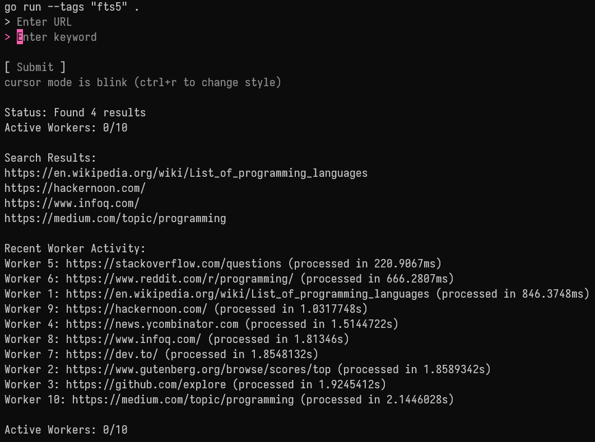

# concurrent-scrapper-ftsearch

TUI program to concurrently scrap the web, then save to local sqlite with fts5, which enable full text search



## Install dependencies via Brew or Winget

- Go
- Sqlite

```bash
clang -O2 -I. -DSQLITE_ENABLE_FTS4 -DSQLITE_ENABLE_FTS5 -DSQLITE_ENABLE_JSON1 -DSQLITE_ENABLE_RTREE -DSQLITE_ENABLE_COLUMN_METADATA -DSQLITE_ENABLE_EXPLAIN_COMMENTS -DSQLITE_ENABLE_DBSTAT_VTAB -DSQLITE_ENABLE_MATH_FUNCTIONS *.c -o sqlite3.exe
```

```bash
clang -O2 -I. -DSQLITE_ENABLE_FTS4 -DSQLITE_ENABLE_FTS5 -DSQLITE_ENABLE_JSON1 -DSQLITE_ENABLE_RTREE -DSQLITE_ENABLE_COLUMN_METADATA -DSQLITE_ENABLE_EXPLAIN_COMMENTS -DSQLITE_ENABLE_DBSTAT_VTAB -DSQLITE_ENABLE_MATH_FUNCTIONS *.c -shared -o sqlite3.dll
```

## Run

```bash
make build  # Build the application
make run    # Run the application
make clean  # Clean up the binary and database file (use with caution)
```

## TODO

### Recursive Crawling

- Parse the HTML content for additional links
- Add a mechanism to determine whether to follow those links
- Implement depth-limiting to prevent infinite crawling
- Respect robots.txt and avoid crawling the same URL multiple times
